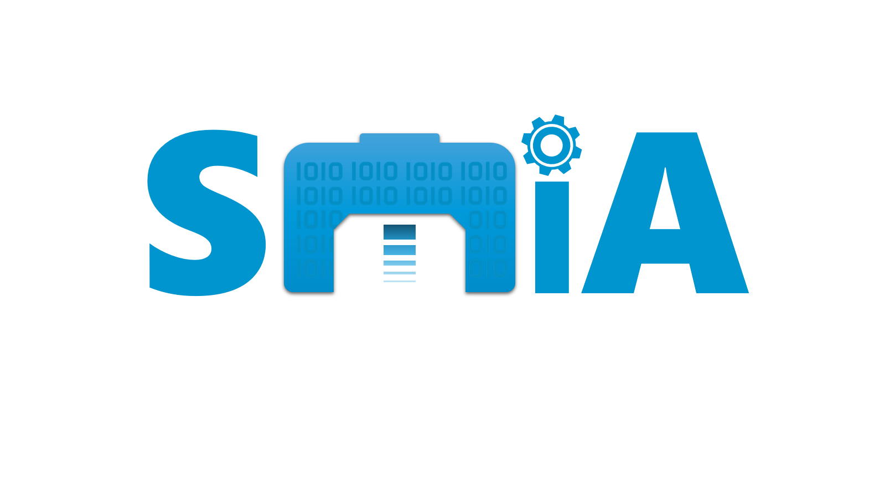

Getting Started
===============

SMIA is a software that implements an AAS-compliant Digital Twin (DT) that is based on a flexible manufacturing-centered ontology.

The features of the SMIA approach include:

    - free & open-source
    - AAS-compliant: standardized approach
    - Ontology-based
    - easily customizable and configurable
    - self-configuration at software startup
    - easy to usage
    - containerized solution

Additional tools
----------------

There are some additional tools offered within the SMIA approach. All of these tools are available in the GitHub repository.

    .. button-link:: https://github.com/ekhurtado/I4_0_SMIA/tree/main/additional_tools/aas_ontology_reader/
            :color: primary
            :outline:

            :octicon:`mark-github;1em` AAS ontology reader

    This tool contains the source code of a reader capable of analyzing an AAS model based on a given OWL ontology.

    .. button-link:: https://github.com/ekhurtado/I4_0_SMIA/tree/main/additional_tools/aasx_package_explorer_resources/
            :color: primary
            :outline:

            :octicon:`mark-github;1em` AASX Package Explorer Resources

    This tool contains the JSON files to extend the AASX Package Explorer software with the Capability-Skill-Service (CSS) model.

    .. button-link:: https://github.com/ekhurtado/I4_0_SMIA/tree/main/additional_tools/capability_skill_ontology/
            :color: primary
            :outline:

            :octicon:`mark-github;1em` CSS ontology model

    This tool contains the ontology for the Capability-Skill-Service (CSS) model in an OWL file. It also provides some ExtendedClasses implemented in Python.

    .. button-link:: https://github.com/ekhurtado/I4_0_SMIA/tree/main/additional_tools/gui_agent/
            :color: primary
            :outline:

            :octicon:`mark-github;1em` GUI Agent

    This tool provides a SPADE agent with an easy-to-use graphical interface. This agent provides several useful functionalities for SMIA usage and execution.

Documentation project structure
-------------------------------

The SMIA project documentation repository is structured as follows:

    :octicon:`repo;1em` :ref:`Installation guide`: this guide helps with the installation of the necessary resources to run SMIA.

    :octicon:`repo;1em` :ref:`SMIA User Guide`: this guide helps with the usage of SMIA software and related tools.

    .. :octicon:`repo;1em` :ref:`AAS Developer Guide`: this guide helps with the development of the :term:`AAS model`, that is the basis for SMIA self-configuration.

    :octicon:`code-review;1em` :ref:`Source code documentation`: the entire documented source code of SMIA software.

    :octicon:`book;1em` :ref:`Glossary`: the glossary shows the list of terms relating to the SMIA approach.

    :octicon:`link-external;1em` :ref:`Recommended Links`: information related to SMIA approach is available in this section.

..    :octicon:`link;1em` :ref:`Recommended Links`: information related to SMIA approach is available in this section.

.. TODO hay que pensar como hacer esta pagina

.. TODO Pensar si añadir aqui las guias

.. Getting started pages examples

.. `<https://faaast-service.readthedocs.io/en/latest/basics/getting-started.html>`_

.. `<https://ranchermanager.docs.rancher.com/getting-started/overview>`_

.. `<https://kubernetes.io/docs/setup/>`_
