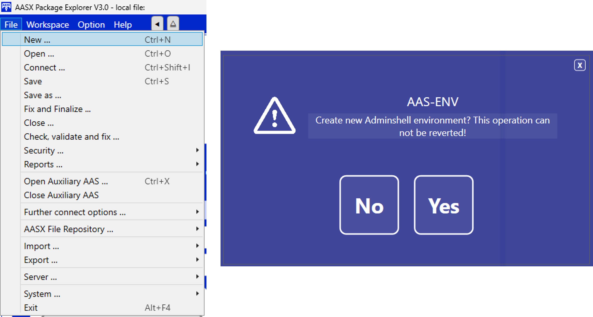

AAS User Guide
==============

This guide is a comprehensive resource for using the :term:`SMIA` software. For a better understanding of the software, the guide is divided into several subsections, each of which focuses on one step of the process.

Development of the AAS
----------------------

This section is focused on the development of the :term:`AAS` model.

.. important::

   If the necessary tools for SMIA have not been installed and configured correctly, please follow the guide :ref:`installation_guide` before proceeding.

The development of the AAS model will be realized using the :ref:`AASX Package Explorer`, so it is necessary to open this program.

After opening the program, the first step is to create a new environment in order to add the desired definition of the AAS model.

.. youtube:: ToKwxUhuiRE

https://www.youtube.com/watch?v=ToKwxUhuiRE&list=PLs6bFF_iqW3G8AiVVMPi-SpupCvgmYsyB&index=1