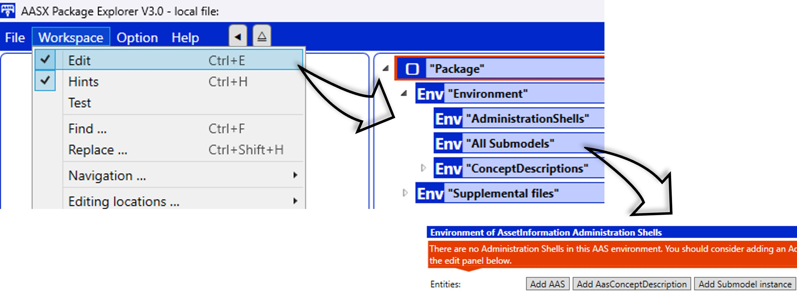
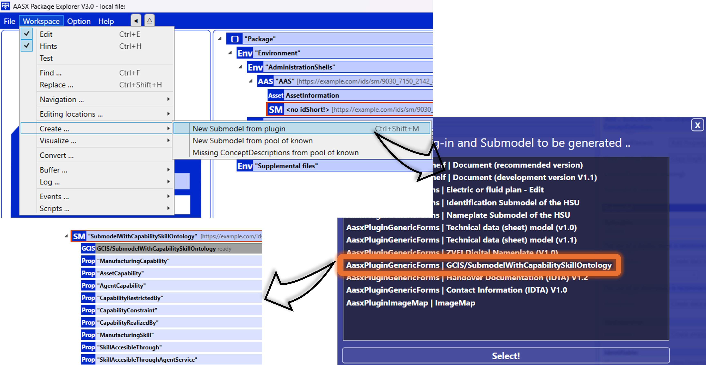

AAS Development Guide
=====================

.. _AAS Development Guide:

This guide is focused on the development of the :term:`AAS` model.

.. important::

   If the necessary tools for SMIA have not been installed and configured correctly, please follow the guide :ref:`Installation guide` before proceeding.

The development of the AAS model will be realized using the :ref:`AASX Package Explorer`, so it is necessary to open this program.

Building the AAS environment
----------------------------

After opening the program, the first step is to create a new environment in order to add the desired definition of the AAS model.

.. image:: ../_static/images/AASX_PE_step1.png
  :align: center
  :width: 400
  :alt: AASX Package Explorer step1

The next step is to enable edit mode, which can be found in ``Workspace > Edit``. Once enabled, you will see the AAS environment structure, which is currently empty.

.. important::

    Due to a bug in AASX Package Explorer, it is recommended to add an empty AAS, a submodel and a ConceptDescription before proceeding to the next step. Afterwards, once the initial steps have been completed, they can be deleted without any problem.

Now we can add the SMIA submodel to import all semantic identifiers based on the CSS ontology (which has been pre-added in the installation of the tool as shown in :ref:`Installation guide`).

To do this, simply click on the AAS to be added, and use either the keyboard shortcut (``Ctrl + Shift + M``) or the program interface (``Workspace > Create ... > New Submodel from plugin``). In either case, a list of submodels to import will appear, from which **GCIS/SubmodelWithCapabilitySkillOntology** must be chosen.

.. tip::

    If the AAS is not selected before selecting the submodel via the plugin, the program will present an error. Make sure that the AAS to which the submodel is to be added is selected.

IDTA template submodels will be added following the same process (**Asset Interfaces Description** and **Nameplate for Software in Manufacturing**).

.. tip::

    It is not limited to which AAS the submodels should be included, but the following structure is recommended:

        * Asset Interfaces Description :octicon:`arrow-right;1em` AAS for asset
        * Nameplate for Software in Manufacturing :octicon:`arrow-right;1em` AAS for SMIA

Defining asset interfaces
-------------------------

All interfaces of the asset will be defined in the ``AssetInterfacesDescription`` submodel, proposed by IDTA. The `specification document <https://industrialdigitaltwin.org/en/wp-content/uploads/sites/2/2024/01/IDTA-02017-1-0_Submodel_Asset-Interfaces-Description.pdf>`_, as well as the `GitHub repository <https://github.com/admin-shell-io/submodel-templates/tree/main/published/Asset%20Interfaces%20Description/1/0>`_ of the submodel template, are available in the offered links.

.. Developing CSS-based the AAS model
.. ----------------------------------

.. TODO FALTA POR HACER

.. Youtube videos test
.. -------------------

.. TODO: Test to add Youtube videos in Sphinx RTD documentation.

.. .. youtube:: ToKwxUhuiRE

