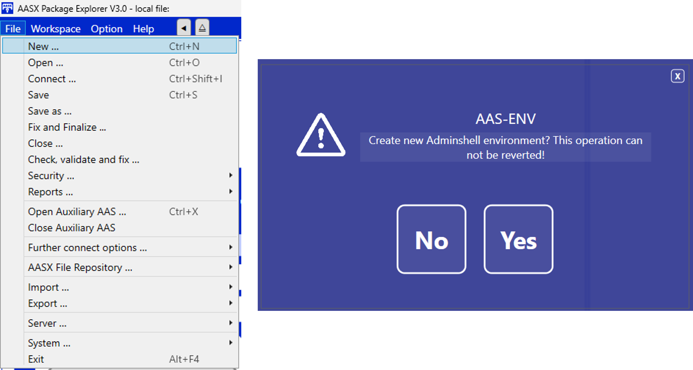
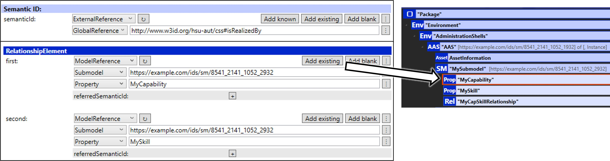

AAS Development Guide
=====================

.. _AAS Development Guide:

This guide is focused on the development of the :term:`AAS` model.

.. important::

   If the necessary tools for SMIA have not been installed and configured correctly, please follow the guide :octicon:`repo;1em` :ref:`Installation Guide` before proceeding.

The development of the AAS model will be realized using the :ref:`AASX Package Explorer`, so it is necessary to open this program.

Building the AAS environment
----------------------------

After opening the program, the first step is to create a new environment in order to add the desired definition of the AAS model.

The next step is to enable edit mode, which can be found in ``Workspace > Edit``. Once enabled, you will see the AAS environment structure, which is currently empty.

.. important::

    Due to a bug in AASX Package Explorer, it is recommended to add an empty AAS, a submodel and a ConceptDescription before proceeding to the next step. Afterwards, once the initial steps have been completed, they can be deleted without any problem.

Now we can add the SMIA submodel to import all semantic identifiers based on the CSS ontology (which has been pre-added in the installation of the tool as shown in :octicon:`repo;1em` :ref:`Installation Guide`).

To do this, simply click on the AAS to be added, and use either the keyboard shortcut (``Ctrl + Shift + M``) or the program interface (``Workspace > Create ... > New Submodel from plugin``). In either case, a list of submodels to import will appear, from which **GCIS/SubmodelWithCapabilitySkillOntology** must be chosen.

.. tip::

    If the AAS is not selected before selecting the submodel via the plugin, the program will present an error. Make sure that the AAS to which the submodel is to be added is selected.

IDTA template submodels will be added following the same process (**Asset Interfaces Description** and **Nameplate for Software in Manufacturing**).

.. tip::

    It is not limited to which AAS the submodels should be included, but the following structure is recommended:

        * Asset Interfaces Description :octicon:`arrow-right;1em` AAS for asset
        * Nameplate for Software in Manufacturing :octicon:`arrow-right;1em` AAS for SMIA

Defining asset interfaces
-------------------------

All interfaces of the asset will be defined in the ``AssetInterfacesDescription`` submodel, proposed by IDTA. The `specification document <https://industrialdigitaltwin.org/en/wp-content/uploads/sites/2/2024/01/IDTA-02017-1-0_Submodel_Asset-Interfaces-Description.pdf>`_, as well as the `GitHub repository <https://github.com/admin-shell-io/submodel-templates/tree/main/published/Asset%20Interfaces%20Description/1/0>`_ of the submodel template, are available in the offered links.

.. TODO FALTA POR HACER

Developing CSS-based the AAS model
----------------------------------

The definition of the AAS model is not limited in the SMIA approach. Any Submodel and Submodel Element can be added following any structural decision. When it is desired to link a Submodel Element to a concept within the CSS ontology, it is only required to add the appropriate identifier as an attribute, specifically in the semantic identifier attribute (``semanticid``). Since both concepts and the relationships between them can be defined in the ontology, two options will be detailed in the following subsections.

Linking AAS elements to ontological concepts
^^^^^^^^^^^^^^^^^^^^^^^^^^^^^^^^^^^^^^^^^^^^

As mentioned, the connection between the AAS model and the OWL-based CSS model is made through semantic identifiers. The steps to link an element of the submodel within the AAS model with a concept defined within an ontology are as follows:

#. **Locate the concept within the ontology:** locate the concept to be added in the AAS model and check the IRI value. The Protégé software can be used for this, as it is an OWL-based ontology editor and viewer.
#. **Select the AAS element:** decide which is the AAS element to be linked, and navigate to it using the AASX Package Explorer tool.
#. **Add the semantic identifier:** to do this, make sure that the AAS element is clicked, then click on :bdg-light:`Create data element` and :bdg-light:`Add existing` in `semanticid`` section. When the AAS tree is displayed, navigate to the ConceptDescription associated with the desired concept (*the IRI can be used to check it, as it will be the same as the id of the ConceptDescription*). When the concept is selected, the ``semanticid`` will be updated. This process is show in the following figure:

.. TODO añadir referencia al software Protege

Linking AAS elements within ontological relationships
^^^^^^^^^^^^^^^^^^^^^^^^^^^^^^^^^^^^^^^^^^^^^^^^^^^^^

The relationships between concepts within an ontology can also be transferred to the AAS model, i.e., semantic identifiers can also be used to point out relationships between ontological concepts. To do so, the steps to follow are:

1. **Create an AAS Submodel Element of type relationship:** decide the location where the new Submodel Element will be created by clicking on the submodel (or collection or list). Click :bdg-light:`Add other..` in ``SubmodelElement`` section and, when the options are displayed, click ``RelationshipElement``. The new SubmodelElement will be create, as shown in the following figure:

2. **Add the semantic identifier:** following the same procedure explained in the previous subsection, add the ``semanticid`` of the ontological relationship.
3. **Add the related AAS elements:** select the AAS elements that are part of the relationship using :bdg-light:`Add existing`.

.. Youtube videos test
.. -------------------

.. TODO: Test to add Youtube videos in Sphinx RTD documentation.

.. .. youtube:: ToKwxUhuiRE

