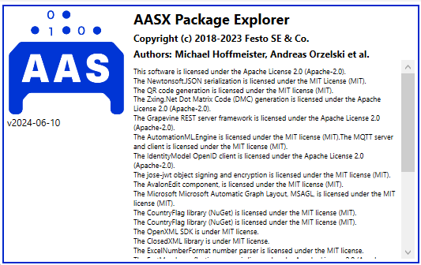

Installation Guide
==================

.. _Installation Guide:

This guide is a comprehensive utility to properly install and configure the necessary tools for the :term:`SMIA` software. For a better understanding of the software, the guide is divided into several subsections, each showing one of the tools.

AASX Package Explorer
---------------------

.. _AASX Package Explorer:

The `AASX Package Explorer <https://github.com/eclipse-aaspe/package-explorer>`_ is is a viewer and editor for the Asset Administration Shell (:term:`AAS`). It is licensed under the Apache License 2.0 and it is available for Windows 10+ based systems.

Software installation
~~~~~~~~~~~~~~~~~~~~~

For installing the AASX Package Explorer the binaries are provided in the project `releases <https://github.com/eclipse-aaspe/package-explorer/releases>`_ section of GitHub.

.. tip::

    Up to now, the latest version of the software is the `v2024-06-10.alpha <https://github.com/eclipse-aaspe/package-explorer/releases/tag/v2024-06-10.alpha>`_. The ZIP file with all necessary files can be downloaded from the `aasx-package-explorer.2024-06-10.alpha.zip <https://github.com/eclipse-aaspe/package-explorer/releases/download/v2024-06-10.alpha/aasx-package-explorer.2024-06-10.alpha.zip>`_.

Software configuration
~~~~~~~~~~~~~~~~~~~~~~

Once the AASX Package Explorer is installed, it is necessary to update some configuration files to add the necessary resources for the correct operation of SMIA.

Adding the custom submodel templates
^^^^^^^^^^^^^^^^^^^^^^^^^^^^^^^^^^^^^

AASX Package Explorer allows adding custom submodel templates in the form of plugins. With this feature, submodels can be easily created automatically. All new submodel templates must be added as ``AasxPluginGenericForms``.

In the case of the SMIA approach, a submodel has been developed with all necessary semantic identifiers to easily import all ConceptDescriptions with semantic identifiers related to the Capability-Skill-Service ontology used at runtime.

To do so, first the JSON object with the submodel template definition will be collected, available in the `GitHub as additional tool link <https://raw.githubusercontent.com/ekhurtado/I4_0_SMIA/capabilityskill_tests/additional_tools/aasx_package_explorer_resources/SMIA-css-semantic-ids-sm.add-options.json>`_.

When the JSON object is obtained, it is necessary to copy it to the following path, relative to where the AASX Package Explorer has been installed:

    *<path to AASX Package Explorer installation>/AasxPackageExplorer/plugins/AasxPluginGenericForms/*

Once the file is copied there, the next time the program is initialized, the submodel can be easily created from the options: ``Workspace > Create ... > New Submodel from plugin``, or by pressing ``Ctrl + Shift + M``.

The same has to be done with the IDTA submodel templates, in order to add them to the AASX Package Software tool. To be as clear as possible, all JSON files to be copied as plugins are added in the dropdown below.

.. dropdown:: Links to all JSON objects to be added as plugins
       :octicon:`link;1em;sd-text-primary`

       .. button-link:: https://raw.githubusercontent.com/ekhurtado/I4_0_SMIA/main/additional_tools/aasx_package_explorer_resources/SMIA-css-semantic-ids-sm.add-options.json
            :color: primary
            :outline:

            :octicon:`mark-github;1em` JSON file of the plugin for the CSS ontology submodel template

       .. button-link:: https://raw.githubusercontent.com/ekhurtado/I4_0_SMIA/main/additional_tools/aasx_package_explorer_resources/IDTA-02017-1-0_Template_Asset_Interfaces_Description.add-options.json
            :color: primary
            :outline:

            :octicon:`mark-github;1em` JSON file of the plugin for the Asset Interfaces Description IDTA submodel template

       .. button-link:: https://raw.githubusercontent.com/ekhurtado/I4_0_SMIA/main/additional_tools/aasx_package_explorer_resources/IDTA-02007-1-0_Template_Software_Nameplate.add-options.json
            :color: primary
            :outline:

            :octicon:`mark-github;1em` JSON file of the plugin for the Nameplate for Software in Manufacturing IDTA submodel template

Adding the qualifier templates
^^^^^^^^^^^^^^^^^^^^^^^^^^^^^^

Another useful feature is to add presets to Qualifier elements, in order to use them easily without the need to add information from the user. To do this, in this case another JSON file will be added to an existing program configuration file. The JSON objects with the qualifier presets for SMIA are available as `GitHub additional tool <https://raw.githubusercontent.com/ekhurtado/I4_0_SMIA/capabilityskill_tests/additional_tools/aasx_package_explorer_resources/SMIA-css-qualifier-presets.json>`_.

In this case, the content of the JSON file should be copied and pasted to the end of the ``qualifier-presets.json`` configuration file available in the same installation folder as the program executable (*AasxPackageExplorer*).

.. warning::

    Be careful, the JSON must be valid, so consider that this configuration file is a JSON Array, and that is why the JSON content starts with ','.

.. tip::

    All of these resources are offered as a `SMIA additional tool <https://github.com/ekhurtado/I4_0_SMIA/tree/main/additional_tools/aasx_package_explorer_resources>`_.

Python
------

Python is the base programming language of SMIA. In order to install Python environment it is available at the `official web page <https://www.python.org/downloads/>`_.

.. note::

    SMIA works with Python 3.10, 3.11 and 3.12.

Dependency modules
~~~~~~~~~~~~~~~~~~

SMIA is built in top of some required Python modules. ``Pip``, as the package installer for Python, can be used to install them.

BaSyx Python SDK
^^^^^^^^^^^^^^^^

BaSyx SDK is used by SMIA to manage the AAS model in Python. It can be installed using pip, executing ``pip install basyx-python-sdk``.

SPADE
^^^^^

SPADE is a multi-agent system platform on which the SMIA software has been built. An official installation guide is available at `<https://spade-mas.readthedocs.io/en/latest/installation.html>`_.

OWLReady2
^^^^^^^^^

OWLReady2 is used by SMIA to manage the OWL-based CSS ontology in Python. An official installation guide is available at `<https://owlready2.readthedocs.io/en/v0.47/install.html>`_.

.. dropdown:: Recommended version for all modules
    :octicon:`package-dependencies;1em;sd-text-primary`

    .. code:: bash

        pip install basyx-python-sdk==1.1.0

    .. code:: bash

        pip install spade==3.3.3

    .. code:: bash

        pip install owlready2==0.47

SMIA source code
~~~~~~~~~~~~~~~~

There are two ways to install the SMIA source code. In addition to the dependency modules, it can be installed using pip, as it is available in the PyPI repository, by running:

.. code:: bash

    pip install smia

The alternative is to download the entire source code from the official SMIA GitHub repository. It can be obtained by clicking on :bdg-primary:`<> Code` and then ``Download ZIP`` or it can be cloned using ``Git``, by executing:

.. code:: bash

    git clone https://github.com/ekhurtado/I4_0_SMIA.git
